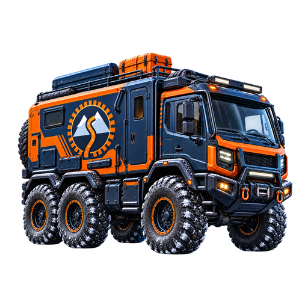

  

<h1 align="center">SnowRunner Studio</h1>

Prepara tu expedición. Un editor visual para vehículos, remolques y componentes de SnowRunner.

  <a href="https://github.com/OscarD0823/snowrunner/releases/latest"><strong>Descargar para Windows</strong></a> ·
  <a href="docs/user-guide.md">Guía de uso</a> ·
  <a href="CHANGELOG.md">Novedades</a> ·
  <a href="README.EN.md">English</a>

## Instalar

En la [última versión publicada](https://github.com/OscarD0823/snowrunner/releases/latest), abre **Assets** y descarga **SnowRunner.Studio.Setup.exe**. Está pensado para Windows x64 con SnowRunner instalado; no necesitas Node.js para usarlo. Las actualizaciones se distribuyen por GitHub, no por Microsoft Store.

## Qué puedes hacer

- Explorar **vehículos, remolques, motores, neumáticos y cabrestantes** en bibliotecas independientes.
- Filtrar contenido base, DLC y mods; ver favoritos y modificados, y buscar contenido nuevo.
- Editar con valores originales, explicaciones y niveles **Poco / Medio / Alto**, con copia de seguridad de `initial.pak`.
- Mantener el vehículo visible junto a los ajustes, con una distribución adaptable para pantalla dividida.
- Previsualizar neumáticos compatibles y suspensión al editar ese tipo de componente, con modelos y texturas locales cuando están disponibles.
- Ver carátulas del juego y miniaturas de mods compatibles, o asociar una imagen local cuando no existe una carátula.
- Recorrer una escena animada de nieve, barro, bosque y rocas, con pausa y respeto por movimiento reducido.

La interfaz ofrece los 13 idiomas de SnowRunner. Los nombres se leen de los textos locales del juego; cuando no hay una traducción disponible, se usa el nombre inglés.

## Antes de modificar

Cierra el juego y conserva tus copias. Solo **Guardar** aplica los parámetros editados; las selecciones del visor no guardan cambios automáticamente. Las recomendaciones no garantizan estabilidad en todos los vehículos, mods o situaciones.

La vista 3D es una escena propia, no el motor ni la física de SnowRunner. Usa el chasis, accesorios predeterminados y primer esquema de pintura compatible, no la configuración de tu partida. Algunas miniaturas son representativas y los modelos de mods no compatibles conservan su carátula.

## Documentación

- [Guía de uso, imágenes y copias](docs/user-guide.md)
- [Desarrollo y compilación](docs/development.md)
- [Historial de versiones](CHANGELOG.md) · [Índice de documentación](docs/README.md)
- [Privacidad](PRIVACY.md)

## Autor y licencia

Edición, interfaz y flujo de trabajo por [@OscarD0823](https://github.com/OscarD0823). También disponible: [RoadCraft Studio](https://github.com/OscarD0823/roadcraft).

Código bajo [licencia MIT](LICENSE), conservando los [avisos de terceros](NOTICE.md) y sus [licencias](THIRD_PARTY_NOTICES.md). Herramienta no oficial, sin afiliación con Saber Interactive ni Focus Entertainment. Los recursos del juego se leen de tu instalación; no se incluyen en el repositorio ni en el instalador.
